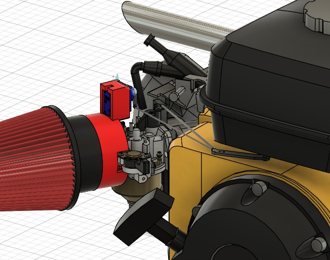

# Engine Servo Throttle Controller

A universal servo-based throttle control system for small utility engines such as Predator 212 and Honda GX200 style engines.

This project provides a mechanical and electronic solution to control engine throttle using a microcontroller and servo motor while preserving compatibility with the stock governor system.

The system is designed to be reproducible using 3D printed components and commonly available hardware.

---

## Project Preview

---

## Features

- Universal servo mounting system
- Compatible with common small engines
- Governor linkage integration
- Adjustable throttle linkage
- Air filter mounting support
- ESP32 based servo control
- Fully simulated and validated CAD mechanism

---

## System Overview

The servo motor actuates the throttle through a linkage mechanism synchronized with the governor arm, allowing electronic control while maintaining mechanical safety behavior.

The project includes:

- Servo mounting bracket
- Adjustable linkage rods
- Carburetor throttle interface
- Air filter adapter
- ESP32 control firmware
- Wiring reference

All parts were assembled and tested in CAD with motion constraints to ensure correct kinematic behavior before manufacturing.

---

## Hardware Requirements

- ESP32 or compatible microcontroller
- Servo motor (MG996R or similar high-torque servo recommended)
- 3D printed mounting parts
- Linkage rods or wire
- External power supply for servo
- Small engine compatible with GX200-style layout

---

## Repository Structure

